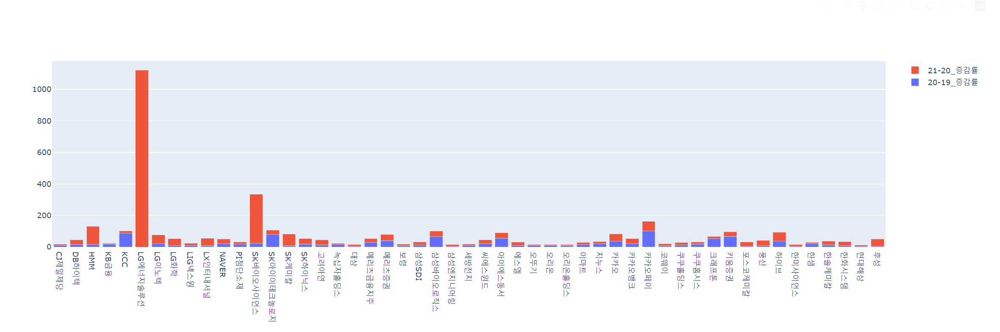

# Import 라이브러리


```python
from tqdm import tqdm
from bs4 import BeautifulSoup
import pandas as pd
import requests
# 그래프의 tpye과 title 결정
from plotly.subplots import make_subplots
# graph object의 배치
import plotly.graph_objects as go 
# iplot을 사용할 수 있고, offline으로 연결
import cufflinks as cf
cf.go_offline(connected=True)

from selenium import webdriver
from selenium.webdriver.support import expected_conditions as EC
from selenium.webdriver.support.ui import WebDriverWait
from selenium.webdriver.common.by import By
import warnings
warnings.filterwarnings('ignore')

import time
```


# 함수 import


```python
def wait_by_xpath(xpath):
   element = WebDriverWait(driver,10).until(EC.presence_of_element_located((By.XPATH, xpath)))
   return element

# url 생성 함수
def set_url(page):
    url = 'https://finance.naver.com/sise/entryJongmok.naver?order=itemname&isRightDirection=true&page=' + str(page)
    return url


def get_stock_data(url):

    res = requests.get(url)
    res.status_code

    soup = BeautifulSoup(res.content,'html.parser')

    종목_list = soup.select('td.ctg')
    종목코드_list = soup.select('td.ctg > a')
    현재가_list = soup.select('td:nth-child(2)')
    전일비_list = soup.select('td.rate_down2')
    등락률_list = soup.select('td:nth-child(4) > span')
    거래량_list = soup.select('td.number')
    거래대금_list = soup.select('td:nth-child(6)')
    시가총액_list = soup.select('td:nth-child(7)')

    종목_list_text  = []
    종목코드_list_text = []
    현재가_list_text = []
    전일비_list_text = []
    등락률_list_text = []
    거래량_list_text = []
    거래대금_list_text = []
    시가총액_list_text  = []

    # 종목명
    for 종목 in 종목_list:
        종목_list_text.append(종목.text)
        
    for 종목코드 in 종목코드_list:
        href = 종목코드.attrs['href']
        code = href.split("=")[1]
        종목코드_list_text.append(code)

    # 현재가
    for 현재가 in 현재가_list[:-1]:
        현재가_list_text.append(현재가.text.strip())

    # 전일비
    for 전일비 in 전일비_list:
        전일비_list_text.append(전일비.text.strip())

    # 등락률
    for 등락률 in 등락률_list:
        등락률_list_text.append(등락률.text.strip())

    # 거래량
    for 거래량 in 거래량_list:
        거래량_list_text.append(거래량.text.strip())

    # 거래대금
    for 거래대금 in 거래대금_list[:-1]:
        거래대금_list_text.append(거래대금.text)

    # 시가총액
    for 시가총액 in 시가총액_list[:-1]:
        시가총액_list_text.append(시가총액.text)
        
    # 데이터 파싱
    dict_info = {"종목별" : 종목_list_text, '종목코드' : 종목코드_list_text, '현재가' :현재가_list_text , '전일비' : 전일비_list_text, 
           '등락율' : 등락률_list_text, '거래량' : 거래량_list_text ,'거래대금' : 거래대금_list_text 
           ,'시가총액' : 시가총액_list_text}
    
    # 데이터 프레임 생성
    df = pd.DataFrame(dict_info)
    
    return df


# 종목코드 url_list 만들기
def set_url_code():
    url_list = []
    for code in df_stock['종목코드']:
        url = 'https://finance.naver.com/item/main.naver?code=' + code
        url_list.append(url)
    return url_list


## get_sales_data
def get_sales_data(url_list):

    sales_data1 = []
    sales_data2 = []
    sales_data3 = []
    date_list = []
    
    for i in url_list:
        print(i)
        res = requests.get(i)
        soup = BeautifulSoup(res.content,'html.parser')

        # 설정된 기간 수집
        content = soup.select_one('.tb_type1.tb_num.tb_type1_ifrs')
        content_data_tr = content.select('tr')[1]
        content_data_th = content_data_tr.select('th')
        for th in content_data_th[:3]:
            if th.text.strip() not in date_list:
                date_list.append(th.text.strip())
    #             date_list.append(th.text.strip())
            else:
                break
                
        # 3년 매출액
        content = soup.select_one('.tb_type1.tb_num.tb_type1_ifrs')
        content_tr = content.select('tr')[3]
        content_td = content_tr.select('td')
        temp_data = []
        for td in content_td[:3]:
            temp_data.append(td.text.strip())
            
        sales_data1.append(temp_data[0])
        sales_data2.append(temp_data[1])
        sales_data3.append(temp_data[2])

    dict_info = dict(zip(date_list,[sales_data1, sales_data2, sales_data3]))
    df = pd.DataFrame(dict_info)
    return df
```

# 주식 데이터 수집


```python
# 데이터 가져오기

col = ['종목별','종목코드', '현재가', '전일비', '등락율', '거래량', '거래대금', '시가총액']
df_stock = pd.DataFrame(columns= col)

for i in tqdm(range(20)): # 3번째 페이지까지
    url_stock = set_url(i+1)
    df = get_stock_data(url_stock)
    df_stock = df_stock.append(df)
    
# 인덱스 초기화
df_stock = df_stock.reset_index(drop=True)
df_stock
```

    100%|██████████████████████████████████████████████████████████████████████████████████| 20/20 [00:02<00:00,  8.31it/s]

</style>
<table border="1" class="dataframe">
  <thead>
    <tr style="text-align: right;">
      <th></th>
      <th>종목별</th>
      <th>종목코드</th>
      <th>현재가</th>
      <th>전일비</th>
      <th>등락율</th>
      <th>거래량</th>
      <th>거래대금</th>
      <th>시가총액</th>
    </tr>
  </thead>
  <tbody>
    <tr>
      <th>0</th>
      <td>BGF리테일</td>
      <td>282330</td>
      <td>187,500</td>
      <td>5,500</td>
      <td>-2.85%</td>
      <td>55,644</td>
      <td>10,378</td>
      <td>32,407</td>
    </tr>
    <tr>
      <th>1</th>
      <td>BNK금융지주</td>
      <td>138930</td>
      <td>7,720</td>
      <td>30</td>
      <td>-0.39%</td>
      <td>516,643</td>
      <td>4,003</td>
      <td>25,162</td>
    </tr>
    <tr>
      <th>2</th>
      <td>CJ</td>
      <td>001040</td>
      <td>83,500</td>
      <td>400</td>
      <td>+0.48%</td>
      <td>33,720</td>
      <td>2,790</td>
      <td>24,363</td>
    </tr>
    <tr>
      <th>3</th>
      <td>CJ CGV</td>
      <td>079160</td>
      <td>26,350</td>
      <td>500</td>
      <td>-1.86%</td>
      <td>141,201</td>
      <td>3,748</td>
      <td>10,763</td>
    </tr>
    <tr>
      <th>4</th>
      <td>CJ대한통운</td>
      <td>000120</td>
      <td>132,500</td>
      <td>1,000</td>
      <td>+0.76%</td>
      <td>26,391</td>
      <td>3,461</td>
      <td>30,226</td>
    </tr>
    <tr>
      <th>...</th>
      <td>...</td>
      <td>...</td>
      <td>...</td>
      <td>...</td>
      <td>...</td>
      <td>...</td>
      <td>...</td>
      <td>...</td>
    </tr>
    <tr>
      <th>195</th>
      <td>효성</td>
      <td>004800</td>
      <td>82,600</td>
      <td>400</td>
      <td>-0.48%</td>
      <td>16,648</td>
      <td>1,381</td>
      <td>17,405</td>
    </tr>
    <tr>
      <th>196</th>
      <td>효성첨단소재</td>
      <td>298050</td>
      <td>467,000</td>
      <td>5,500</td>
      <td>+1.19%</td>
      <td>12,606</td>
      <td>5,897</td>
      <td>20,921</td>
    </tr>
    <tr>
      <th>197</th>
      <td>효성티앤씨</td>
      <td>298020</td>
      <td>371,000</td>
      <td>6,000</td>
      <td>-1.59%</td>
      <td>15,212</td>
      <td>5,697</td>
      <td>16,056</td>
    </tr>
    <tr>
      <th>198</th>
      <td>후성</td>
      <td>093370</td>
      <td>24,150</td>
      <td>450</td>
      <td>+1.90%</td>
      <td>7,690,271</td>
      <td>184,039</td>
      <td>22,365</td>
    </tr>
    <tr>
      <th>199</th>
      <td>휠라홀딩스</td>
      <td>081660</td>
      <td>31,700</td>
      <td>700</td>
      <td>+2.26%</td>
      <td>393,546</td>
      <td>12,440</td>
      <td>19,258</td>
    </tr>
  </tbody>
</table>
<p>200 rows × 8 columns</p>
</div>


# 매출데이터 수집


```python
def get_sales_data_selenium(sales_url):
    sales_2019, sales_2020, sales_2021 = [],[],[]
    for url in tqdm(sales_url):
        driver.get(url)
        # xpath 대기
        wait_by_xpath('//*[@id="content"]/div[4]/div[1]/table/tbody/tr[1]/td')
        sales_2019.append(driver.find_element_by_xpath('//*[@id="content"]/div[4]/div[1]/table/tbody/tr[1]/td[1]').text)
        sales_2020.append(driver.find_element_by_xpath('//*[@id="content"]/div[4]/div[1]/table/tbody/tr[1]/td[2]').text)
        sales_2021.append(driver.find_element_by_xpath('//*[@id="content"]/div[4]/div[1]/table/tbody/tr[1]/td[3]').text)
#     print("2019", sales_2019)
#     print('2020', sales_2020)
#     print('2021', sales_2021)
    dict_info = {'2019.12': sales_2019, '2020.12' : sales_2020, '2021.12' : sales_2021}
#     print('dict_info', dict_info)
    df_sales = pd.DataFrame(dict_info)
#     print('df_sales', df_sales)
    return df_sales
    
```


```python
# sales_url 생성
sales_url = set_url_code()
```


```python
driver_path = 'C:\\Users\\tgkang\\PyData\\크롤링\\101\\chromedriver.exe'

# 자동화 문구 제거
option = webdriver.ChromeOptions()
option.add_experimental_option("useAutomationExtension", False)
option.add_experimental_option("excludeSwitches", ['enable-automation'])
# 브라우져 실행
driver = webdriver.Chrome(driver_path, chrome_options=option)

# 전체화면
driver.maximize_window()
```


```python
# 작업개시
df_sales = get_sales_data_selenium(sales_url)
df_sales
```

    100%|████████████████████████████████████████████████████████████████████████████████| 200/200 [02:41<00:00,  1.24it/s]

</style>
<table border="1" class="dataframe">
  <thead>
    <tr style="text-align: right;">
      <th></th>
      <th>2019.12</th>
      <th>2020.12</th>
      <th>2021.12</th>
    </tr>
  </thead>
  <tbody>
    <tr>
      <th>0</th>
      <td>59,461</td>
      <td>61,813</td>
      <td>67,812</td>
    </tr>
    <tr>
      <th>1</th>
      <td>52,795</td>
      <td>52,124</td>
      <td>55,807</td>
    </tr>
    <tr>
      <th>2</th>
      <td>337,797</td>
      <td>319,991</td>
      <td>344,840</td>
    </tr>
    <tr>
      <th>3</th>
      <td>19,423</td>
      <td>5,834</td>
      <td>7,363</td>
    </tr>
    <tr>
      <th>4</th>
      <td>104,151</td>
      <td>107,811</td>
      <td>113,437</td>
    </tr>
    <tr>
      <th>...</th>
      <td>...</td>
      <td>...</td>
      <td>...</td>
    </tr>
    <tr>
      <th>195</th>
      <td>31,756</td>
      <td>25,962</td>
      <td>35,389</td>
    </tr>
    <tr>
      <th>196</th>
      <td>30,536</td>
      <td>23,946</td>
      <td>35,978</td>
    </tr>
    <tr>
      <th>197</th>
      <td>59,831</td>
      <td>51,616</td>
      <td>85,960</td>
    </tr>
    <tr>
      <th>198</th>
      <td>2,489</td>
      <td>2,616</td>
      <td>3,813</td>
    </tr>
    <tr>
      <th>199</th>
      <td>34,504</td>
      <td>31,288</td>
      <td>37,940</td>
    </tr>
  </tbody>
</table>
<p>200 rows × 3 columns</p>
</div>


# 데이터분석


```python
# 데이터 합치기

df_total = pd.concat([df_stock,df_sales], axis=1)
df_total

# 전처리 - 부호
df_total['부호'] = df_total['등락율'].str[0]

df_total['등락율'] = df_total['등락율'].str.replace("[+-]","")
df_total['등락율'] = df_total['등락율'].str.replace('%',"")

df_total['등락율'] = df_total['등락율'].str.replace(",", '')
df_total['2019.12'] = df_total['2019.12'].str.replace(",", '')

df_total['2020.12'] = df_total['2020.12'].str.replace(",", '')

df_total['2021.12'] = df_total['2021.12'].str.replace(",", '')

df_total['현재가'] = df_total['현재가'].str.replace(",", '')
df_total['전일비'] = df_total['전일비'].str.replace(",", '')
df_total['거래량'] = df_total['거래량'].str.replace(",", '')
df_total['거래대금'] = df_total['거래대금'].str.replace(",", '')
df_total['시가총액'] = df_total['시가총액'].str.replace(",", '')
df_total
```

</style>

<table border="1" class="dataframe">
  <thead>
    <tr style="text-align: right;">
      <th></th>
      <th>종목별</th>
      <th>종목코드</th>
      <th>현재가</th>
      <th>전일비</th>
      <th>등락율</th>
      <th>거래량</th>
      <th>거래대금</th>
      <th>시가총액</th>
      <th>2019.12</th>
      <th>2020.12</th>
      <th>2021.12</th>
      <th>부호</th>
    </tr>
  </thead>
  <tbody>
    <tr>
      <th>0</th>
      <td>BGF리테일</td>
      <td>282330</td>
      <td>187500</td>
      <td>5500</td>
      <td>2.85</td>
      <td>55644</td>
      <td>10378</td>
      <td>32407</td>
      <td>59461</td>
      <td>61813</td>
      <td>67812</td>
      <td>-</td>
    </tr>
    <tr>
      <th>1</th>
      <td>BNK금융지주</td>
      <td>138930</td>
      <td>7720</td>
      <td>30</td>
      <td>0.39</td>
      <td>516643</td>
      <td>4003</td>
      <td>25162</td>
      <td>52795</td>
      <td>52124</td>
      <td>55807</td>
      <td>-</td>
    </tr>
    <tr>
      <th>2</th>
      <td>CJ</td>
      <td>001040</td>
      <td>83500</td>
      <td>400</td>
      <td>0.48</td>
      <td>33720</td>
      <td>2790</td>
      <td>24363</td>
      <td>337797</td>
      <td>319991</td>
      <td>344840</td>
      <td>+</td>
    </tr>
    <tr>
      <th>3</th>
      <td>CJ CGV</td>
      <td>079160</td>
      <td>26350</td>
      <td>500</td>
      <td>1.86</td>
      <td>141201</td>
      <td>3748</td>
      <td>10763</td>
      <td>19423</td>
      <td>5834</td>
      <td>7363</td>
      <td>-</td>
    </tr>
    <tr>
      <th>4</th>
      <td>CJ대한통운</td>
      <td>000120</td>
      <td>132500</td>
      <td>1000</td>
      <td>0.76</td>
      <td>26391</td>
      <td>3461</td>
      <td>30226</td>
      <td>104151</td>
      <td>107811</td>
      <td>113437</td>
      <td>+</td>
    </tr>
    <tr>
      <th>...</th>
      <td>...</td>
      <td>...</td>
      <td>...</td>
      <td>...</td>
      <td>...</td>
      <td>...</td>
      <td>...</td>
      <td>...</td>
      <td>...</td>
      <td>...</td>
      <td>...</td>
      <td>...</td>
    </tr>
    <tr>
      <th>195</th>
      <td>효성</td>
      <td>004800</td>
      <td>82600</td>
      <td>400</td>
      <td>0.48</td>
      <td>16648</td>
      <td>1381</td>
      <td>17405</td>
      <td>31756</td>
      <td>25962</td>
      <td>35389</td>
      <td>-</td>
    </tr>
    <tr>
      <th>196</th>
      <td>효성첨단소재</td>
      <td>298050</td>
      <td>467000</td>
      <td>5500</td>
      <td>1.19</td>
      <td>12606</td>
      <td>5897</td>
      <td>20921</td>
      <td>30536</td>
      <td>23946</td>
      <td>35978</td>
      <td>+</td>
    </tr>
    <tr>
      <th>197</th>
      <td>효성티앤씨</td>
      <td>298020</td>
      <td>371000</td>
      <td>6000</td>
      <td>1.59</td>
      <td>15212</td>
      <td>5697</td>
      <td>16056</td>
      <td>59831</td>
      <td>51616</td>
      <td>85960</td>
      <td>-</td>
    </tr>
    <tr>
      <th>198</th>
      <td>후성</td>
      <td>093370</td>
      <td>24150</td>
      <td>450</td>
      <td>1.90</td>
      <td>7690271</td>
      <td>184039</td>
      <td>22365</td>
      <td>2489</td>
      <td>2616</td>
      <td>3813</td>
      <td>+</td>
    </tr>
    <tr>
      <th>199</th>
      <td>휠라홀딩스</td>
      <td>081660</td>
      <td>31700</td>
      <td>700</td>
      <td>2.26</td>
      <td>393546</td>
      <td>12440</td>
      <td>19258</td>
      <td>34504</td>
      <td>31288</td>
      <td>37940</td>
      <td>+</td>
    </tr>
  </tbody>
</table>
<p>200 rows × 12 columns</p>
</div>


```python
# 공백 처리
condition = (df_total['2019.12'] == '') | (df_total['2020.12'] == '') | (df_total['2021.12'] == '')

while True:
    try:
        for i in df_total.loc[condition].index :
            if df_total['2019.12'][i] == '':
                df_total['2019.12'][i] = 0
            elif df_total['2020.12'][i] == '':
                df_total['2020.12'][i] = 0
            elif df_total['2021.12'][i] == '':
                df_total['2021.12'][i] = 0
        df_total = df_total.astype({'2019.12':'float', '2020.12' : 'float', '2021.12':'float', '시가총액':'float',
                     '거래대금':'float', '거래량':'float', '전일비':'float','현재가':'float', '등락율':'float'})
        break        
    except ValueError: print('에러발생')

# 데이터 타입확인
df_total.dtypes
```

    종목별         object
    종목코드        object
    현재가        float64
    전일비        float64
    등락율        float64
    거래량        float64
    거래대금       float64
    시가총액       float64
    2019.12    float64
    2020.12    float64
    2021.12    float64
    부호          object
    dtype: object


```python
# 부호 전처리
for idx, i in enumerate(df_total['등락율']):
    if df_total['부호'][idx] == "-":
        df_total['등락율'][idx] = - df_total['등락율'][idx]

# 컬럼생성
df_total['20-19'] = df_total['2020.12'] - df_total['2019.12']
df_total['21-20'] = df_total['2021.12'] - df_total['2020.12']
```


```python
df_total.loc[25]
```


    종목별          LG에너지솔루션
    종목코드           373220
    현재가          408500.0
    전일비            8000.0
    등락율               2.0
    거래량          228952.0
    거래대금          92669.0
    시가총액         955890.0
    2019.12           0.0
    2020.12       14611.0
    2021.12      178519.0
    부호                  +
    20-19         14611.0
    21-20        163908.0
    20-19_증감률         inf
    21-20_증감률      1121.8
    Name: 25, dtype: object


```python
# 증감률 계산
df_total['20-19_증감률'] = ((df_total['20-19'] / df_total['2019.12']) * 100).round(1)
df_total['21-20_증감률'] = ((df_total['21-20'] / df_total['2020.12']) * 100).round(1)
df_total
```

</style>
<table border="1" class="dataframe">
  <thead>
    <tr style="text-align: right;">
      <th></th>
      <th>종목별</th>
      <th>종목코드</th>
      <th>현재가</th>
      <th>전일비</th>
      <th>등락율</th>
      <th>거래량</th>
      <th>거래대금</th>
      <th>시가총액</th>
      <th>2019.12</th>
      <th>2020.12</th>
      <th>2021.12</th>
      <th>부호</th>
      <th>20-19</th>
      <th>21-20</th>
      <th>20-19_증감률</th>
      <th>21-20_증감률</th>
    </tr>
  </thead>
  <tbody>
    <tr>
      <th>0</th>
      <td>BGF리테일</td>
      <td>282330</td>
      <td>187500.0</td>
      <td>5500.0</td>
      <td>-2.85</td>
      <td>55644.0</td>
      <td>10378.0</td>
      <td>32407.0</td>
      <td>59461.0</td>
      <td>61813.0</td>
      <td>67812.0</td>
      <td>-</td>
      <td>2352.0</td>
      <td>5999.0</td>
      <td>4.0</td>
      <td>9.7</td>
    </tr>
    <tr>
      <th>1</th>
      <td>BNK금융지주</td>
      <td>138930</td>
      <td>7720.0</td>
      <td>30.0</td>
      <td>-0.39</td>
      <td>516643.0</td>
      <td>4003.0</td>
      <td>25162.0</td>
      <td>52795.0</td>
      <td>52124.0</td>
      <td>55807.0</td>
      <td>-</td>
      <td>-671.0</td>
      <td>3683.0</td>
      <td>-1.3</td>
      <td>7.1</td>
    </tr>
    <tr>
      <th>2</th>
      <td>CJ</td>
      <td>001040</td>
      <td>83500.0</td>
      <td>400.0</td>
      <td>0.48</td>
      <td>33720.0</td>
      <td>2790.0</td>
      <td>24363.0</td>
      <td>337797.0</td>
      <td>319991.0</td>
      <td>344840.0</td>
      <td>+</td>
      <td>-17806.0</td>
      <td>24849.0</td>
      <td>-5.3</td>
      <td>7.8</td>
    </tr>
    <tr>
      <th>3</th>
      <td>CJ CGV</td>
      <td>079160</td>
      <td>26350.0</td>
      <td>500.0</td>
      <td>-1.86</td>
      <td>141201.0</td>
      <td>3748.0</td>
      <td>10763.0</td>
      <td>19423.0</td>
      <td>5834.0</td>
      <td>7363.0</td>
      <td>-</td>
      <td>-13589.0</td>
      <td>1529.0</td>
      <td>-70.0</td>
      <td>26.2</td>
    </tr>
    <tr>
      <th>4</th>
      <td>CJ대한통운</td>
      <td>000120</td>
      <td>132500.0</td>
      <td>1000.0</td>
      <td>0.76</td>
      <td>26391.0</td>
      <td>3461.0</td>
      <td>30226.0</td>
      <td>104151.0</td>
      <td>107811.0</td>
      <td>113437.0</td>
      <td>+</td>
      <td>3660.0</td>
      <td>5626.0</td>
      <td>3.5</td>
      <td>5.2</td>
    </tr>
    <tr>
      <th>...</th>
      <td>...</td>
      <td>...</td>
      <td>...</td>
      <td>...</td>
      <td>...</td>
      <td>...</td>
      <td>...</td>
      <td>...</td>
      <td>...</td>
      <td>...</td>
      <td>...</td>
      <td>...</td>
      <td>...</td>
      <td>...</td>
      <td>...</td>
      <td>...</td>
    </tr>
    <tr>
      <th>195</th>
      <td>효성</td>
      <td>004800</td>
      <td>82600.0</td>
      <td>400.0</td>
      <td>-0.48</td>
      <td>16648.0</td>
      <td>1381.0</td>
      <td>17405.0</td>
      <td>31756.0</td>
      <td>25962.0</td>
      <td>35389.0</td>
      <td>-</td>
      <td>-5794.0</td>
      <td>9427.0</td>
      <td>-18.2</td>
      <td>36.3</td>
    </tr>
    <tr>
      <th>196</th>
      <td>효성첨단소재</td>
      <td>298050</td>
      <td>467000.0</td>
      <td>5500.0</td>
      <td>1.19</td>
      <td>12606.0</td>
      <td>5897.0</td>
      <td>20921.0</td>
      <td>30536.0</td>
      <td>23946.0</td>
      <td>35978.0</td>
      <td>+</td>
      <td>-6590.0</td>
      <td>12032.0</td>
      <td>-21.6</td>
      <td>50.2</td>
    </tr>
    <tr>
      <th>197</th>
      <td>효성티앤씨</td>
      <td>298020</td>
      <td>371000.0</td>
      <td>6000.0</td>
      <td>-1.59</td>
      <td>15212.0</td>
      <td>5697.0</td>
      <td>16056.0</td>
      <td>59831.0</td>
      <td>51616.0</td>
      <td>85960.0</td>
      <td>-</td>
      <td>-8215.0</td>
      <td>34344.0</td>
      <td>-13.7</td>
      <td>66.5</td>
    </tr>
    <tr>
      <th>198</th>
      <td>후성</td>
      <td>093370</td>
      <td>24150.0</td>
      <td>450.0</td>
      <td>1.90</td>
      <td>7690271.0</td>
      <td>184039.0</td>
      <td>22365.0</td>
      <td>2489.0</td>
      <td>2616.0</td>
      <td>3813.0</td>
      <td>+</td>
      <td>127.0</td>
      <td>1197.0</td>
      <td>5.1</td>
      <td>45.8</td>
    </tr>
    <tr>
      <th>199</th>
      <td>휠라홀딩스</td>
      <td>081660</td>
      <td>31700.0</td>
      <td>700.0</td>
      <td>2.26</td>
      <td>393546.0</td>
      <td>12440.0</td>
      <td>19258.0</td>
      <td>34504.0</td>
      <td>31288.0</td>
      <td>37940.0</td>
      <td>+</td>
      <td>-3216.0</td>
      <td>6652.0</td>
      <td>-9.3</td>
      <td>21.3</td>
    </tr>
  </tbody>
</table>
<p>200 rows × 16 columns</p>
</div>


```python
# 컬럼 뷰 정리
df_증감률 = df_total[['종목별','20-19_증감률', '21-20_증감률']]

# 5% 이상 추리기
df_증감률_5퍼 = df_증감률[(df_증감률['20-19_증감률'] >=5) & (df_증감률['21-20_증감률'] >=5)]
```


```python
df_증감률_5퍼
```

</style>
<table border="1" class="dataframe">
  <thead>
    <tr style="text-align: right;">
      <th></th>
      <th>종목별</th>
      <th>20-19_증감률</th>
      <th>21-20_증감률</th>
    </tr>
  </thead>
  <tbody>
    <tr>
      <th>5</th>
      <td>CJ제일제당</td>
      <td>8.5</td>
      <td>8.4</td>
    </tr>
    <tr>
      <th>7</th>
      <td>DB하이텍</td>
      <td>15.9</td>
      <td>29.8</td>
    </tr>
    <tr>
      <th>16</th>
      <td>HMM</td>
      <td>16.3</td>
      <td>115.1</td>
    </tr>
    <tr>
      <th>17</th>
      <td>KB금융</td>
      <td>18.0</td>
      <td>5.8</td>
    </tr>
    <tr>
      <th>18</th>
      <td>KCC</td>
      <td>86.9</td>
      <td>15.6</td>
    </tr>
    <tr>
      <th>25</th>
      <td>LG에너지솔루션</td>
      <td>inf</td>
      <td>1121.8</td>
    </tr>
    <tr>
      <th>27</th>
      <td>LG이노텍</td>
      <td>19.6</td>
      <td>56.6</td>
    </tr>
    <tr>
      <th>29</th>
      <td>LG화학</td>
      <td>9.9</td>
      <td>41.9</td>
    </tr>
    <tr>
      <th>30</th>
      <td>LIG넥스원</td>
      <td>10.2</td>
      <td>13.9</td>
    </tr>
    <tr>
      <th>33</th>
      <td>LX인터내셔널</td>
      <td>7.1</td>
      <td>47.9</td>
    </tr>
    <tr>
      <th>34</th>
      <td>NAVER</td>
      <td>21.8</td>
      <td>28.5</td>
    </tr>
    <tr>
      <th>37</th>
      <td>PI첨단소재</td>
      <td>17.0</td>
      <td>15.3</td>
    </tr>
    <tr>
      <th>44</th>
      <td>SK바이오사이언스</td>
      <td>22.7</td>
      <td>311.8</td>
    </tr>
    <tr>
      <th>47</th>
      <td>SK아이이테크놀로지</td>
      <td>78.4</td>
      <td>28.7</td>
    </tr>
    <tr>
      <th>49</th>
      <td>SK케미칼</td>
      <td>7.7</td>
      <td>74.3</td>
    </tr>
    <tr>
      <th>51</th>
      <td>SK하이닉스</td>
      <td>18.2</td>
      <td>34.8</td>
    </tr>
    <tr>
      <th>55</th>
      <td>고려아연</td>
      <td>13.3</td>
      <td>31.6</td>
    </tr>
    <tr>
      <th>63</th>
      <td>녹십자홀딩스</td>
      <td>15.1</td>
      <td>7.1</td>
    </tr>
    <tr>
      <th>65</th>
      <td>대상</td>
      <td>5.0</td>
      <td>11.5</td>
    </tr>
    <tr>
      <th>89</th>
      <td>메리츠금융지주</td>
      <td>27.6</td>
      <td>25.2</td>
    </tr>
    <tr>
      <th>90</th>
      <td>메리츠증권</td>
      <td>39.4</td>
      <td>40.0</td>
    </tr>
    <tr>
      <th>93</th>
      <td>보령</td>
      <td>7.2</td>
      <td>11.6</td>
    </tr>
    <tr>
      <th>95</th>
      <td>삼성SDI</td>
      <td>11.9</td>
      <td>20.0</td>
    </tr>
    <tr>
      <th>97</th>
      <td>삼성바이오로직스</td>
      <td>66.0</td>
      <td>34.6</td>
    </tr>
    <tr>
      <th>100</th>
      <td>삼성엔지니어링</td>
      <td>5.6</td>
      <td>10.9</td>
    </tr>
    <tr>
      <th>108</th>
      <td>세방전지</td>
      <td>10.0</td>
      <td>7.9</td>
    </tr>
    <tr>
      <th>115</th>
      <td>씨에스윈드</td>
      <td>21.2</td>
      <td>24.2</td>
    </tr>
    <tr>
      <th>119</th>
      <td>아이에스동서</td>
      <td>55.8</td>
      <td>34.0</td>
    </tr>
    <tr>
      <th>120</th>
      <td>에스엘</td>
      <td>10.7</td>
      <td>19.8</td>
    </tr>
    <tr>
      <th>126</th>
      <td>오뚜기</td>
      <td>10.0</td>
      <td>5.5</td>
    </tr>
    <tr>
      <th>127</th>
      <td>오리온</td>
      <td>10.2</td>
      <td>5.6</td>
    </tr>
    <tr>
      <th>128</th>
      <td>오리온홀딩스</td>
      <td>8.4</td>
      <td>5.9</td>
    </tr>
    <tr>
      <th>131</th>
      <td>이마트</td>
      <td>15.6</td>
      <td>13.2</td>
    </tr>
    <tr>
      <th>135</th>
      <td>지누스</td>
      <td>21.1</td>
      <td>13.6</td>
    </tr>
    <tr>
      <th>136</th>
      <td>카카오</td>
      <td>35.4</td>
      <td>47.6</td>
    </tr>
    <tr>
      <th>137</th>
      <td>카카오뱅크</td>
      <td>21.0</td>
      <td>32.4</td>
    </tr>
    <tr>
      <th>138</th>
      <td>카카오페이</td>
      <td>101.6</td>
      <td>61.3</td>
    </tr>
    <tr>
      <th>141</th>
      <td>코웨이</td>
      <td>7.2</td>
      <td>13.2</td>
    </tr>
    <tr>
      <th>142</th>
      <td>쿠쿠홀딩스</td>
      <td>11.3</td>
      <td>16.6</td>
    </tr>
    <tr>
      <th>143</th>
      <td>쿠쿠홈시스</td>
      <td>18.5</td>
      <td>13.6</td>
    </tr>
    <tr>
      <th>144</th>
      <td>크래프톤</td>
      <td>53.6</td>
      <td>12.9</td>
    </tr>
    <tr>
      <th>145</th>
      <td>키움증권</td>
      <td>66.6</td>
      <td>29.8</td>
    </tr>
    <tr>
      <th>149</th>
      <td>포스코케미칼</td>
      <td>5.6</td>
      <td>27.0</td>
    </tr>
    <tr>
      <th>150</th>
      <td>풍산</td>
      <td>5.8</td>
      <td>35.3</td>
    </tr>
    <tr>
      <th>152</th>
      <td>하이브</td>
      <td>35.6</td>
      <td>57.7</td>
    </tr>
    <tr>
      <th>162</th>
      <td>한미사이언스</td>
      <td>5.0</td>
      <td>10.8</td>
    </tr>
    <tr>
      <th>164</th>
      <td>한샘</td>
      <td>21.7</td>
      <td>7.9</td>
    </tr>
    <tr>
      <th>167</th>
      <td>한솔케미칼</td>
      <td>13.8</td>
      <td>24.1</td>
    </tr>
    <tr>
      <th>176</th>
      <td>한화시스템</td>
      <td>6.3</td>
      <td>27.2</td>
    </tr>
    <tr>
      <th>191</th>
      <td>현대해상</td>
      <td>5.1</td>
      <td>6.4</td>
    </tr>
    <tr>
      <th>198</th>
      <td>후성</td>
      <td>5.1</td>
      <td>45.8</td>
    </tr>
  </tbody>
</table>


```python
import plotly.graph_objects as go

x= df_증감률_5퍼['종목별']
fig = go.Figure(go.Bar(x = x, y = df_증감률_5퍼['20-19_증감률'], name='20-19_증감률'))
fig.add_trace(go.Bar(x = x, y = df_증감률_5퍼['21-20_증감률'], name='21-20_증감률'))
# fig.add_trace(go.Bar(x=x, y=[6, 8, 4.5, 8], name='Toronto'))

fig.update_layout(barmode='stack', xaxis={'categoryorder':'array'})
fig.show()
```




```python
df_증감률_5퍼.to_csv("주식종목결과.csv",encoding='euc-kr')
```


